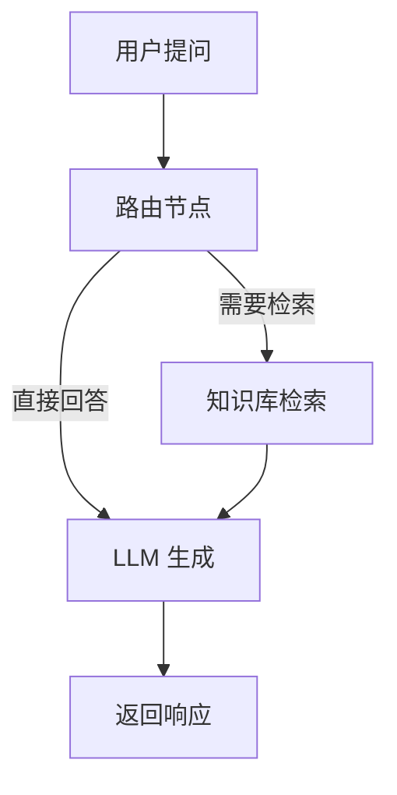

# Website Live Chat Agent

基于 **LangGraph + Milvus + DeepSeek** 的智能客服 Agent，提供 OpenAI 兼容 API 供 WordPress 插件调用。

## 🚀 核心特性

- ✅ **OpenAI 兼容 API**：WordPress 插件只需修改 Base URL 即可接入
- ✅ **RAG 知识库检索**：从 Milvus 向量数据库检索网站内容（FAQ、产品信息等）
- ✅ **LangGraph Agent**：状态机式工作流，可控、可调试、可扩展
- ✅ **多 LLM 支持**：DeepSeek（默认）、OpenAI、Claude
- ✅ **流式响应**：支持 SSE 实时输出
- ✅ **会话持久化**：LangGraph Checkpointer + Redis

## 📋 技术栈

| 组件 | 技术 | 说明 |
|------|------|------|
| Web 框架 | FastAPI | 高性能异步 API |
| Agent 框架 | LangGraph | 状态机式 Agent 编排 |
| LLM | DeepSeek | 默认模型（支持 OpenAI/Claude） |
| 向量数据库 | Milvus | 已独立部署 |
| 会话存储 | Redis | 短期缓存 + Checkpointer |
| Python | 3.13+ | 类型提示、异步支持 |

## 🛠️ 快速开始

### 1. 安装依赖

```bash
# 使用 uv（推荐）
uv pip install -e .

# 或使用 pip
pip install -e .
```

### 2. 配置环境变量

```bash
cp .env.example .env
vim .env
```

**必填配置**:
```bash
# DeepSeek API
DEEPSEEK_API_KEY=sk-your-deepseek-api-key

# Milvus 连接
MILVUS_HOST=your-milvus-host
MILVUS_PORT=19530

# API 认证
API_KEY=your-secure-api-key
```

### 3. 启动服务

```bash
# 开发模式（热重载）
python src/main.py

# 或使用 uvicorn
uvicorn src.main:app --reload --host 0.0.0.0 --port 8000
```

### 4. 访问 API 文档

- Swagger UI: http://localhost:8000/docs
- ReDoc: http://localhost:8000/redoc
- OpenAPI JSON: http://localhost:8000/openapi.json

## 🧪 测试

### 运行测试

```bash
# 安装测试依赖
pip install -e ".[dev]"

# 运行所有测试
pytest

# 运行特定类型的测试
pytest tests/unit/           # 单元测试
pytest tests/integration/    # 集成测试
pytest tests/e2e/            # E2E 测试

# 生成覆盖率报告
pytest --cov=src --cov-report=html
open htmlcov/index.html
```

### 使用测试脚本

```bash
# 使测试脚本可执行
chmod +x scripts/run_tests.sh

# 运行不同类型的测试
./scripts/run_tests.sh unit        # 单元测试
./scripts/run_tests.sh integration # 集成测试
./scripts/run_tests.sh e2e         # E2E 测试
./scripts/run_tests.sh coverage    # 覆盖率报告
./scripts/run_tests.sh all         # 所有测试
```

### 测试覆盖率目标

| 模块 | 目标覆盖率 |
|------|-----------|
| `src/core/*` | 90%+ |
| `src/services/*` | 85%+ |
| `src/agent/*` | 80%+ |
| `src/api/*` | 90%+ |

📚 **详细测试文档**: [docs/qa/testing.md](docs/qa/testing.md)

---

## 📚 API 使用

### OpenAI 兼容端点

```bash
curl -X POST http://localhost:8000/v1/chat/completions \
  -H "Authorization: Bearer your-api-key" \
  -H "Content-Type: application/json" \
  -d '{
    "model": "deepseek-chat",
    "messages": [
      {"role": "user", "content": "你们的退货政策是什么？"}
    ],
    "stream": false
  }'
```

### 知识库上传

```bash
curl -X POST http://localhost:8000/api/v1/knowledge/upsert \
  -H "Authorization: Bearer your-api-key" \
  -H "Content-Type: application/json" \
  -d '{
    "documents": [
      {
        "text": "我们的退货政策：收到商品后30天内可申请退货...",
        "metadata": {
          "title": "退货政策",
          "url": "https://example.com/return-policy",
          "category": "政策"
        }
      }
    ]
  }'
```

### 知识库检索测试

```bash
curl "http://localhost:8000/api/v1/knowledge/search?query=退货政策&top_k=3" \
  -H "Authorization: Bearer your-api-key"
```

## 🔧 WordPress 插件集成

### 配置步骤

1. 安装支持自定义 API 的 WordPress AI 聊天插件
2. 进入插件设置页
3. 选择 "Custom OpenAI Compatible API"
4. 填入配置：
   - **API Base URL**: `http://your-server:8000/v1`
   - **API Key**: `your-secure-api-key`
5. 保存并测试连接

### 支持的插件

- AI Chatbot for WordPress
- WP AI Assistant  
- ChatGPT Plugin
- 任何支持自定义 OpenAI API Endpoint 的插件

## 📁 项目结构

```
website-live-chat-agent/
├── docs/                      # 文档
│   ├── epics/                 # Epic 需求文档
│   ├── adr/                   # 架构决策记录
│   ├── api/                   # OpenAPI 规范
│   └── runbooks/              # 运行手册
├── src/                       # 源代码
│   ├── api/v1/                # API 端点
│   │   ├── openai_compat.py   # /v1/chat/completions
│   │   └── knowledge.py       # 知识库管理
│   ├── agent/                 # LangGraph Agent
│   │   ├── state.py           # AgentState 定义
│   │   ├── tools.py           # 检索工具
│   │   ├── nodes.py           # 节点函数
│   │   ├── edges.py           # 条件边
│   │   └── graph.py           # StateGraph 构建
│   ├── core/                  # 核心模块
│   │   ├── config.py          # 配置管理
│   │   ├── exceptions.py      # 异常定义
│   │   └── security.py        # API Key 认证
│   ├── services/              # 业务服务
│   │   ├── milvus_service.py  # Milvus 向量库
│   │   └── llm_factory.py     # LLM 工厂
│   ├── models/                # 数据模型
│   └── main.py                # FastAPI 应用入口
├── tests/                     # 测试
├── pyproject.toml             # 项目配置
└── README.md                  # 本文件
```

## 🔍 LangGraph Agent 工作流



**节点说明**:
- **Router**: 判断是否需要检索知识库（基于关键词）
- **Retrieve**: 从 Milvus 检索 Top-K 相关文档
- **LLM**: 调用 DeepSeek LLM 生成最终响应

## 🧪 测试

```bash
# 运行所有测试
pytest

# 测试覆盖率
pytest --cov=src --cov-report=html

# 测试 Agent（需要配置环境变量）
python test_agent.py
```

## 🐳 Docker 部署

```bash
# 构建镜像
docker build -t website-live-chat-agent:latest .

# 运行容器
docker run -d \
  --name chat-agent \
  -p 8000:8000 \
  -e DEEPSEEK_API_KEY=sk-xxx \
  -e MILVUS_HOST=your-milvus-host \
  -e API_KEY=your-api-key \
  website-live-chat-agent:latest
```

## 📖 文档

- [Epic-001: 需求文档](docs/epics/epic-001-langgraph-rag-agent.md)
- [ADR-0001: LangGraph 架构决策](docs/adr/0001-langgraph-architecture.md)
- [ADR-0002: Milvus 集成设计](docs/adr/0002-milvus-integration.md)
- [OpenAPI 规范](docs/api/openapi.yaml)

## ⚙️ 配置说明

### LLM 配置

支持切换 LLM 提供商（通过环境变量 `LLM_PROVIDER`）:

```bash
# DeepSeek（默认）
LLM_PROVIDER=deepseek
DEEPSEEK_API_KEY=sk-xxx

# OpenAI
LLM_PROVIDER=openai
OPENAI_API_KEY=sk-xxx

# Claude
LLM_PROVIDER=anthropic
ANTHROPIC_API_KEY=sk-ant-xxx
```

### 模型别名配置（WordPress 无缝集成）

**⚠️ 重要提示**: 此功能允许系统对外显示 OpenAI 品牌的模型名称（如 `gpt-4o-mini`），但实际使用的是 DeepSeek 模型。启用前请理解相关的法律和品牌风险（详见 [ADR-0003](docs/adr/0003-model-alias-strategy.md)）。

**使用场景**:
- WordPress 用户希望使用现有 OpenAI 插件直接接入本系统
- 需要零配置的插件兼容性

**配置示例**:
```bash
# 启用模型别名（默认禁用）
MODEL_ALIAS_ENABLED=true

# 对外显示的模型名称
MODEL_ALIAS_NAME=gpt-4o-mini

# 模型所有者标识
MODEL_ALIAS_OWNED_BY=openai

# 隐藏 embedding 模型（仅返回聊天模型）
HIDE_EMBEDDING_MODELS=true
```

**API 行为**:
- **启用后**: `/v1/models` 返回 `gpt-4o-mini`，请求可使用该别名
- **禁用时**（默认）: 返回实际模型名 `deepseek-chat`

**免责声明**:
本系统与 OpenAI Inc. 无关。当启用模型别名功能时，返回的模型名称仅用于 API 兼容性目的，实际执行的是 DeepSeek 语言模型。使用者应确保此配置符合当地法律法规和服务条款要求。

**详细文档**: [ADR-0003: 模型别名策略](docs/adr/0003-model-alias-strategy.md)

### RAG 配置

```bash
# 知识库检索 Top-K
RAG_TOP_K=3

# 相似度分数阈值
RAG_SCORE_THRESHOLD=0.7

# 文档切片大小
RAG_CHUNK_SIZE=500
RAG_CHUNK_OVERLAP=50
```

## 🤝 贡献

欢迎提交 Issue 和 Pull Request！

## 📄 许可证

MIT License

---

**Built with ❤️ using LangGraph + Milvus + DeepSeek**
