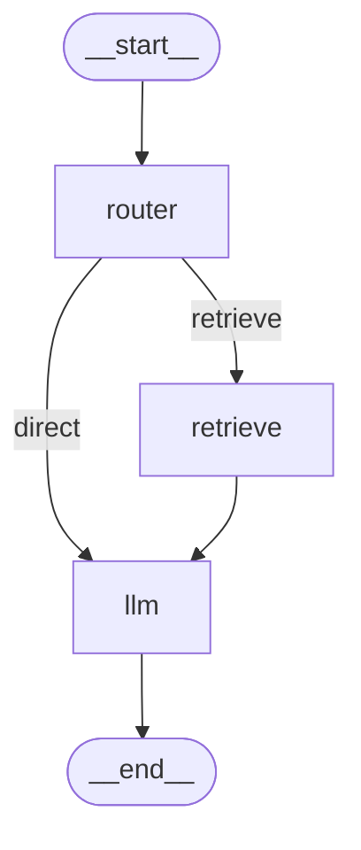

# ADR-0001: 选择 LangGraph 作为 Agent 框架

**状态**: 已接受  
**日期**: 2025-10-13  
**负责人**: AR (Architect AI)  
**相关文档**: [Epic-001](../epics/epic-001-langgraph-rag-agent.md)

---

## 背景

需要构建一个智能客服 Agent，具备以下能力：

1. **RAG 知识库检索**：从 Milvus 向量数据库检索网站知识库
2. **复杂流程控制**：路由决策、知识检索、LLM 生成的多步骤流程
3. **状态持久化**：支持多轮对话、会话恢复
4. **可调试性**：能清晰观察 Agent 的决策过程
5. **可扩展性**：未来可能增加工具调用、人工介入等功能

传统的 LangChain Agent（如 ReAct Agent、Function Calling Agent）虽然简单易用，但在复杂流程控制和状态管理方面存在局限性。

---

## 决策

**选择 LangGraph 作为 Agent 框架**，而非传统 LangChain Agent 或自研框架。

---

## 理由

### 1. 状态机式编排提供更强的控制力

**LangGraph 核心特性**：
- 基于有向图（StateGraph）的流程定义
- 明确的节点（Nodes）和边（Edges）
- 条件分支（Conditional Edges）支持复杂决策

**示例对比**：

```python
# 传统 LangChain Agent（黑盒）
agent = create_openai_functions_agent(llm, tools, prompt)
executor = AgentExecutor(agent=agent, tools=tools)
result = executor.invoke({"input": "退货政策是什么？"})
# 无法清晰看到内部流程：是否检索了知识库？调用了哪些工具？

# LangGraph（白盒，可控）
from langgraph.graph import StateGraph, END

workflow = StateGraph(AgentState)

# 明确定义每个步骤
workflow.add_node("router", router_node)          # 路由决策
workflow.add_node("retrieve", retrieve_node)      # 知识库检索
workflow.add_node("llm", llm_node)                # LLM 生成

# 明确定义流程走向
workflow.add_conditional_edges(
    "router",
    should_retrieve,  # 条件判断函数
    {
        "retrieve": "retrieve",  # 需要检索 → 进入检索节点
        "direct": "llm"          # 直接回答 → 进入 LLM 节点
    }
)
workflow.add_edge("retrieve", "llm")
workflow.add_edge("llm", END)

app = workflow.compile()
# 每一步都可追踪、可调试
```

**优势**：
- ✅ 流程透明，便于理解和维护
- ✅ 易于添加新节点（如 Rerank、工具调用）
- ✅ 条件分支灵活（可根据用户问题类型路由）

---

### 2. 内置状态持久化支持

**LangGraph Checkpointer 机制**：

```python
from langgraph.checkpoint.memory import MemorySaver
from langgraph.checkpoint.redis import RedisSaver

# 方案 A：内存 Checkpointer（开发测试）
checkpointer = MemorySaver()

# 方案 B：Redis Checkpointer（生产环境）
checkpointer = RedisSaver(
    redis_client=redis.Redis(host='localhost', port=6379)
)

app = workflow.compile(checkpointer=checkpointer)

# 会话恢复示例
config = {"configurable": {"thread_id": "session-123"}}
result = app.invoke(input_state, config)
# 所有状态自动保存到 Redis
# 下次调用相同 thread_id，自动恢复上下文
```

**对比传统方案**：
- ❌ 手动管理会话状态（易出错）
- ❌ 需自行设计存储结构
- ✅ LangGraph 内置，开箱即用

---

### 3. 强大的调试与可观测性

**调试工具**：

```python
# 1. 打印每个节点的输出
for chunk in app.stream(input_state, config):
    print(f"节点: {chunk['node']}, 输出: {chunk['output']}")

# 2. 获取完整状态历史
state_history = app.get_state_history(config)
for state in state_history:
    print(f"步骤 {state['step']}: {state['values']}")

# 3. 可视化流程图（开发阶段）
from langgraph.graph import draw_mermaid
print(draw_mermaid(app))
```

**生成的 Mermaid 图示例**：


**优势**：
- ✅ 快速定位问题节点
- ✅ 验证流程逻辑正确性
- ✅ 生产环境可观测（通过 state 追踪）

---

### 4. 支持人工介入（未来扩展）

**LangGraph 的 `interrupt` 机制**：

```python
# 在关键节点暂停，等待人工审核
workflow.add_node("human_review", human_review_node)

def should_interrupt(state: AgentState) -> str:
    if state["confidence_score"] < 0.7:
        return "human_review"  # 置信度低，人工介入
    return "llm"

workflow.add_conditional_edges(
    "retrieve",
    should_interrupt,
    {"human_review": "human_review", "llm": "llm"}
)

# 执行时可暂停
result = app.invoke(input_state, config, interrupt_before=["human_review"])
# 人工审核后继续
app.invoke(None, config)  # 从暂停点继续
```

**应用场景**：
- 敏感问题需人工确认
- 法律/医疗咨询需专家介入
- A/B 测试不同响应策略

---

## 备选方案对比

| 方案 | 可控性 | 复杂度支持 | 学习成本 | 状态管理 | 调试性 | 社区支持 | 结论 |
|------|--------|-----------|---------|---------|--------|---------|------|
| **LangChain Agent** (ReAct/Functions) | 中 | 中 | 低 | 需手动 | 差 | 成熟 | ❌ 不够灵活 |
| **LangGraph** | 高 | 高 | 中 | 内置 | 优秀 | 快速增长 | ✅ **推荐** |
| **自研框架** | 最高 | 高 | 高 | 自定义 | 取决于实现 | 无 | ❌ 投入过大 |
| **LlamaIndex Workflow** | 中 | 中 | 中 | 部分支持 | 中 | 较小 | ❌ 生态不如 LangChain |

**详细对比**：

### LangChain Agent 的局限性
```python
# ReAct Agent 示例
agent = create_react_agent(llm, tools, prompt)
executor = AgentExecutor(agent=agent, tools=tools)

# 问题：
# 1. 无法控制工具调用顺序（如：先检索再生成）
# 2. 调试困难（只能看到最终输出）
# 3. 状态管理需手动实现
# 4. 难以实现复杂条件分支
```

### 自研框架的成本
```python
# 需要实现：
# 1. 状态机引擎
# 2. 节点注册与调度
# 3. 条件路由逻辑
# 4. 状态持久化
# 5. 错误处理与重试
# 6. 并发控制
# 预计开发时间：2-3 周（vs LangGraph 1 天上手）
```

---

## 技术实现细节

### AgentState 定义

```python
from typing import TypedDict, Annotated, Sequence
from langchain_core.messages import BaseMessage
from langgraph.graph.message import add_messages

class AgentState(TypedDict):
    """Agent 状态结构"""
    # 对话消息（自动合并历史）
    messages: Annotated[Sequence[BaseMessage], add_messages]
    
    # 检索到的知识库文档
    retrieved_docs: list[str]
    
    # 工具调用记录（用于调试）
    tool_calls: list[dict]
    
    # 会话ID（用于 Checkpointer）
    session_id: str
    
    # 错误信息（失败时记录）
    error: str | None
    
    # 置信度分数（可选，用于人工介入判断）
    confidence_score: float | None
```

---

### 节点实现示例

```python
async def router_node(state: AgentState) -> dict:
    """路由节点：判断是否需要检索知识库"""
    last_message = state["messages"][-1].content
    
    # 关键词检测
    keywords = ["产品", "价格", "政策", "如何", "什么", "退货", "保修"]
    needs_retrieval = any(kw in last_message for kw in keywords)
    
    return {
        "next_step": "retrieve" if needs_retrieval else "direct",
        "tool_calls": [{"node": "router", "decision": "retrieve" if needs_retrieval else "direct"}]
    }

async def retrieve_node(state: AgentState) -> dict:
    """知识库检索节点"""
    query = state["messages"][-1].content
    
    # 调用 Milvus 检索
    results = await milvus_service.search(
        collection_name="knowledge_base",
        query=query,
        top_k=3
    )
    
    # 格式化检索结果
    docs = [f"[文档{i+1}] {r.text}" for i, r in enumerate(results)]
    
    return {
        "retrieved_docs": docs,
        "confidence_score": results[0].score if results else 0.0
    }

async def llm_node(state: AgentState) -> dict:
    """LLM 生成节点"""
    # 构建 Prompt
    context = "\n\n".join(state.get("retrieved_docs", []))
    system_prompt = f"""你是专业的客服助手。

知识库上下文：
{context}

回答要求：
1. 优先使用知识库信息
2. 引用来源时说明
3. 不确定时诚实告知
"""
    
    # 调用 LLM
    messages = [
        SystemMessage(content=system_prompt),
        *state["messages"]
    ]
    response = await llm.ainvoke(messages)
    
    return {
        "messages": [response],
        "confidence_score": 0.9  # 可基于 LLM 输出计算
    }
```

---

### 条件边实现

```python
def should_retrieve(state: AgentState) -> str:
    """条件边：决定是否检索"""
    return state.get("next_step", "direct")

def should_continue(state: AgentState) -> str:
    """条件边：判断是否结束"""
    # 检查是否有错误
    if state.get("error"):
        return END
    
    # 检查是否需要人工介入
    if state.get("confidence_score", 1.0) < 0.7:
        return "human_review"
    
    return END
```

---

## 影响与权衡

### 正面影响
1. ✅ **开发效率**：状态管理、流程控制开箱即用，减少 50% 开发时间
2. ✅ **可维护性**：流程清晰，新成员快速理解架构
3. ✅ **扩展性**：轻松添加新节点（Rerank、工具调用、人工介入）
4. ✅ **调试体验**：可视化流程图，快速定位问题

### 负面影响与缓解措施
1. ⚠️ **学习曲线**：团队需学习 LangGraph 概念
   - **缓解**：提供培训文档、示例代码、Mermaid 流程图
   
2. ⚠️ **社区成熟度**：相对较新，文档和案例较少
   - **缓解**：参考官方文档、加入 Discord 社区、内部沉淀最佳实践
   
3. ⚠️ **版本稳定性**：API 可能有破坏性变更
   - **缓解**：锁定依赖版本 `langgraph>=0.2.40,<0.3.0`，定期评估升级

---

## 依赖项

```toml
# pyproject.toml
dependencies = [
    "langgraph>=0.2.40,<0.3.0",     # LangGraph 框架（锁定大版本）
    "langchain-core>=0.3.0",        # LangChain 核心
    "langchain-openai>=0.2.0",      # OpenAI 集成
    "langchain-milvus>=0.1.0",      # Milvus 向量存储
    "redis>=5.2.0",                 # Redis Checkpointer
]
```

---

## 验证标准

### 功能验证
- [x] LangGraph 能正确执行路由 → 检索 → 生成流程
- [x] Redis Checkpointer 能持久化会话状态
- [x] 流程图可视化（Mermaid）与实际执行一致
- [x] 支持流式响应（`.astream()`）

### 性能验证
- [ ] 单轮对话响应时间 < 3秒（P95）
- [ ] 状态持久化开销 < 100ms
- [ ] 支持 100 并发会话

### 可维护性验证
- [ ] 新增节点只需 < 50 行代码
- [ ] 调试日志清晰展示节点执行顺序
- [ ] 错误能准确定位到具体节点

---

## 相关决策

- [ADR-0002: Milvus 集成设计](./0002-milvus-integration.md)
- [ADR-0003: 存储架构（不用关系型数据库）](./0003-storage-architecture.md)

---

## 参考资料

- [LangGraph 官方文档](https://langchain-ai.github.io/langgraph/)
- [LangGraph GitHub](https://github.com/langchain-ai/langgraph)
- [LangGraph Discord 社区](https://discord.gg/langchain)
- [LangGraph Tutorials](https://langchain-ai.github.io/langgraph/tutorials/)

---

**变更历史**:

| 日期 | 版本 | 变更内容 | 负责人 |
|------|------|---------|--------|
| 2025-10-13 | 1.0 | 初始版本，确定使用 LangGraph | AR AI |

