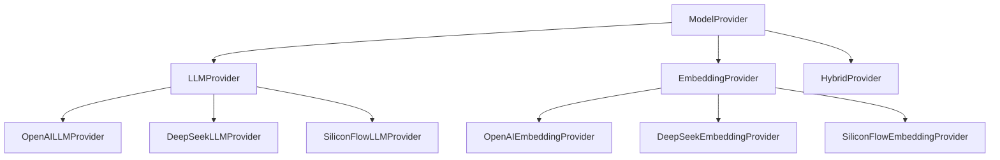

# 插件化模型提供商系统

## 概述

本系统采用插件化架构设计，支持灵活的模型提供商配置和混合模型组合使用。通过统一的接口和动态加载机制，用户可以轻松配置不同的LLM和Embedding提供商。

## 架构设计

### 核心组件

```
src/services/providers/
├── __init__.py          # 提供商注册和发现
├── base.py              # 基础接口定义
├── openai_provider.py   # OpenAI提供商实现
├── deepseek_provider.py # DeepSeek提供商实现
└── siliconflow_provider.py # 硅基流动提供商实现
```

### 接口层次



## 支持的提供商

### OpenAI
- **LLM模型**: gpt-4o-mini, gpt-4o, gpt-3.5-turbo
- **Embedding模型**: text-embedding-3-small, text-embedding-3-large
- **配置要求**: api_key

### DeepSeek
- **LLM模型**: deepseek-chat, deepseek-coder, deepseek-math
- **Embedding模型**: deepseek-embedding
- **配置要求**: api_key, base_url

### 硅基流动
- **LLM模型**: Qwen/Qwen2.5-7B-Instruct, Qwen/Qwen2.5-14B-Instruct
- **Embedding模型**: BAAI/bge-large-zh-v1.5, BAAI/bge-base-zh-v1.5
- **配置要求**: api_key, base_url

## 配置示例

### 基础配置分离

```bash
# LLM配置
LLM_PROVIDER=deepseek
DEEPSEEK_API_KEY=your-deepseek-key
DEEPSEEK_MODEL=deepseek-chat

# Embedding配置  
EMBEDDING_PROVIDER=openai
OPENAI_API_KEY=your-openai-key
EMBEDDING_MODEL=text-embedding-3-small
```

### 硅基流动平台配置

```bash
# 使用硅基流动平台
LLM_PROVIDER=siliconflow
SILICONFLOW_API_KEY=your-sf-key
SILICONFLOW_LLM_MODEL=Qwen/Qwen2.5-7B-Instruct

EMBEDDING_PROVIDER=siliconflow
SILICONFLOW_EMBEDDING_MODEL=BAAI/bge-large-zh-v1.5
```

### 混合模型组合

```bash
# DeepSeek LLM + OpenAI Embedding
LLM_PROVIDER=deepseek
DEEPSEEK_API_KEY=your-deepseek-key
DEEPSEEK_MODEL=deepseek-chat

EMBEDDING_PROVIDER=openai
OPENAI_API_KEY=your-openai-key
EMBEDDING_MODEL=text-embedding-3-small
```

## 使用方式

### 创建模型实例

```python
from src.services.llm_factory import create_llm, create_embeddings

# 创建LLM实例
llm = create_llm()

# 创建Embedding实例
embeddings = create_embeddings()
```

### 配置验证

```python
from src.core.config import settings

# 验证配置
validation_results = settings.validate_configuration()
print(validation_results)
```

### 迁移工具

```python
from src.core.migration import migrate_legacy_config, generate_migration_report

# 执行迁移
migration_result = migrate_legacy_config()

# 生成迁移报告
report = generate_migration_report()
print(report)
```

## 扩展新提供商

### 1. 创建提供商类

```python
# src/services/providers/custom_provider.py
from .base import LLMProvider, EmbeddingProvider

class CustomLLMProvider(LLMProvider):
    def get_required_config_fields(self) -> List[str]:
        return ["api_key", "base_url"]
    
    def create_llm(self) -> BaseChatModel:
        # 实现LLM创建逻辑
        pass
    
    def get_models(self) -> List[str]:
        return ["custom-model-1", "custom-model-2"]
    
    def validate_connection(self) -> bool:
        # 实现连接验证逻辑
        pass
```

### 2. 注册提供商

```python
# src/services/providers/__init__.py
from .custom_provider import CustomLLMProvider

_PROVIDER_REGISTRY["custom_llm"] = CustomLLMProvider
```

### 3. 更新配置

```python
# src/core/config.py
llm_provider: Literal["openai", "anthropic", "deepseek", "siliconflow", "custom"] = Field(
    default="deepseek", description="LLM 提供商"
)
```

## 最佳实践

### 1. 配置管理
- 使用环境变量管理敏感信息
- 为不同环境提供配置模板
- 定期验证配置有效性

### 2. 错误处理
- 实现完善的错误处理机制
- 提供友好的错误信息
- 支持配置验证和测试

### 3. 性能优化
- 使用连接池管理API连接
- 实现缓存机制减少重复请求
- 监控API使用情况

### 4. 安全考虑
- 保护API密钥安全
- 实现访问控制和审计
- 定期轮换密钥

## 故障排除

### 常见问题

1. **配置错误**
   - 检查API密钥是否正确
   - 验证Base URL是否可访问
   - 确认模型名称是否支持

2. **连接失败**
   - 检查网络连接
   - 验证API配额
   - 查看错误日志

3. **性能问题**
   - 检查模型选择是否合适
   - 优化请求参数
   - 考虑使用缓存

### 调试工具

```python
# 启用详细日志
import logging
logging.getLogger("src.services.providers").setLevel(logging.DEBUG)

# 测试连接
from src.services.providers import create_provider
provider = create_provider("openai_llm", {"api_key": "test-key"})
is_valid = provider.validate_connection()
print(f"Connection valid: {is_valid}")
```

## 版本历史

- **v1.0.0**: 初始版本，支持OpenAI、DeepSeek、硅基流动平台
- **v1.1.0**: 添加配置验证和迁移工具
- **v1.2.0**: 支持混合模型组合和动态提供商注册

## 相关文档

- [配置分离指南](../configuration/model-separation.md)
- [迁移指南](../migration/legacy-to-plugin.md)
- [API文档](../../api/openapi.yaml)
